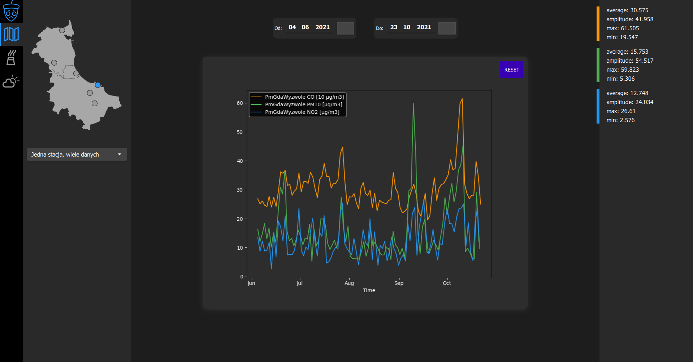

<!-- Improved compatibility of back to top link: See: https://github.com/othneildrew/Best-README-Template/pull/73 -->
<a name="readme-top"></a>
<!--
*** Thanks for checking out the Best-README-Template. If you have a suggestion
*** that would make this better, please fork the repo and create a pull request
*** or simply open an issue with the tag "enhancement".
*** Don't forget to give the project a star!
*** Thanks again! Now go create something AMAZING! :D
-->


<!-- PROJECT LOGO -->
<br />
<div align="center">
  <a href="https://github.com/Krabbens/hackathon-acorn_kerfuffin">
    
  </a>

<h3 align="center">Kerfuffin</h3>

  <p align="center">
    Program do analizy danych o stanie powietrza w Trójmieście.
    <br />
  </p>
</div>


<!-- TABLE OF CONTENTS -->
<details>
  <summary>Spis treści</summary>
  <ol>
    <li>
      <a href="#about-the-project">O projekcie</a>
      <ul>
        <li><a href="#built-with">Stworzony przy pomocy</a></li>
      </ul>
    </li>
    <li>
      <a href="#getting-started">Wprowadzenie</a>
      <ul>
        <li><a href="#prerequisites">Wymagania</a></li>
        <li><a href="#installation">Uruchomienie</a></li>
      </ul>
    </li>
    <li>
      <a href="#usage">Użycie programu</a>
      <ul>
        <li><a href="#chart">Poruszanie się po wykresie</a></li>
      </ul>
    </li>
    <li><a href="#contact">Kontakt</a></li>
  </ol>
</details>


<a name="about-the-project"></a>
<!-- ABOUT THE PROJECT -->
## O projekcie




Ten program został stworzony na BEST Coding Marathon. Wyświetla dane pozyskane przez [Główny Inspektorat Ochrony
Środowiska (GIOŚ)](https://powietrze.gios.gov.pl/pjp/archives) na terenie Trójmiasta.
<br/>
Przedstawia dane o zanieczyszczeniu powietrza i pogodzie, w dowolnym przedziale czasu w roku 2021, na czytelnach wykresach.
Pokazuje też stopień korelacji danych pogodowych (temperatury, wilgotności i wiatru) ze stopniem zanieczyszczenia powietrza.


<p align="right">(<a href="#readme-top">powrót na górę</a>)</p>


<a name="built-with"></a>
### Stworzony przy pomocy

* [![Python][Python.org]][Python-url]
* [![Matplotlib][Matplotlib.org]][Matplotlib-url]
* [![Numpy][Numpy.org]][Numpy-url]
* [![Pandas][Pandas.org]][Pandas-url]
* [![Qt][Qt.io]][Qt-url]
* [![Scipy][Scipy.org]][Scipy-url]

<p align="right">(<a href="#readme-top">powrót na górę</a>)</p>


<a name="getting-started"></a>
<!-- GETTING STARTED -->
## Wprowadzenie


<a name="prerequisites"></a>
### Wymagania

Aby zainstalować wymaganie biblioteki:
* otwórz konsolę w folderze z programem i uruchom komendę:
  ```sh
  pip install -r requirements.txt
  ```
  
<a name="installation"></a>
### Uruchomienie

Aby uruchomić program, otwórz konsolę w folderze z programem i uruchom komendę:
  ```sh
  python main.py
  ```


<p align="right">(<a href="#readme-top">powrót na górę</a>)</p>


<a name="usage"></a>
<!-- USAGE EXAMPLES -->
## Użycie programu

Aby wyświetlić dane na wykresie, należy zaznaczyć co najmniej jedną stację z mapki w pierwszej zakładce.
<br/>
Aby wybrać więcej niż jedną stację, trzeba zmienić tryb wyświetlania danych, "wiele stacji, jedna dana" lub "wiele stacji, wiele danych".
W drugim z tych trybów konieczne jest określenie sposobu łączenia wykresów: uśrednienie, wart. maksymalna lub minimalna.
<br/>
Kolejnym krokiem jest wybranie zanieczyszczeń, które chcemy wyświetlić (w drugiej zakładce).
<br/>
Dodatkowo w trzeciej zakładce można wyświetlić składnik pogodowy, z którym chcemy porównać wykresy. 
<br/><br/>
Nad wykresem znajdują się przyciski do zmiany przedziału czasu.
<br/>
Po prawej stronie okna programu będą wyświetlać się dodatkowe informacje na temat wykresów. Korelacja pojawia się tylko wtedy gdy jest zaznaczony składnik pogodowy.
<br/>

<a name="chart"></a>
### Poruszanie się po wykresie

Scroll - przybliżanie i oddalanie <br/>
Lewy przycisk myszy - przesuwanie wykresu <br/>
Prawy przycisk myszy - skalowanie w osi X i Y <br/>
Przycisk reset obok wykresu - przywraca pierwotny stan wykresu <br/>

<p align="right">(<a href="#readme-top">powrót na górę</a>)</p>


<a name="contact"></a>
<!-- CONTACT -->
## Kontakt

Link do Projektu: [https://github.com/Krabbens/hackathon-acorn_kerfuffin](https://en.wikipedia.org/wiki/Trollface)

<p align="right">(<a href="#readme-top">powrót na górę</a>)</p>


<!-- MARKDOWN LINKS & IMAGES -->
<!-- https://www.markdownguide.org/basic-syntax/#reference-style-links -->

[Python.org]: https://img.shields.io/badge/python-3670A0?style=for-the-badge&logo=python&logoColor=ffdd54
[Python-url]: https://www.python.org/
[Matplotlib.org]: https://img.shields.io/badge/Matplotlib-%23ffffff.svg?style=for-the-badge&logo=Matplotlib&logoColor=black
[Matplotlib-url]: https://matplotlib.org/
[Numpy.org]: https://img.shields.io/badge/numpy-%23013243.svg?style=for-the-badge&logo=numpy&logoColor=white
[Numpy-url]: https://numpy.org/
[Pandas.org]: https://img.shields.io/badge/pandas-%23150458.svg?style=for-the-badge&logo=pandas&logoColor=white
[Pandas-url]: https://pandas.pydata.org/
[Qt.io]: https://img.shields.io/badge/Qt-%23217346.svg?style=for-the-badge&logo=Qt&logoColor=white
[Qt-url]: https://www.qt.io/
[Scipy.org]: https://img.shields.io/badge/SciPy-%230C55A5.svg?style=for-the-badge&logo=scipy&logoColor=%white
[Scipy-url]: https://scipy.org/